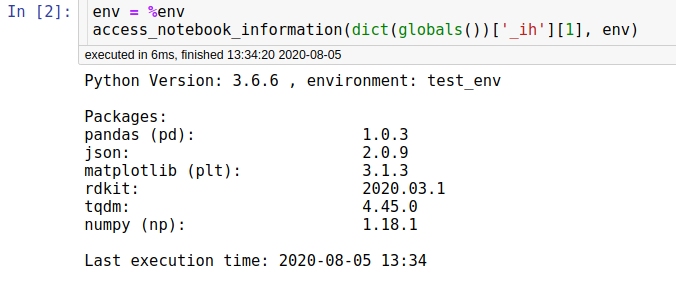

## Jupyter Notebook Information

---

### Basic idea:

Sometimes projects in form of Jupyter notebooks are reviewed years later and the question is raised what environment or
package versions was used. When was the Notebook run the last time? All of this information is not easily obtainable in 
Jupyter notebooks. The idea behind this function is to print all of these information in the beginning of a Jupyter
Notebook and present them to a new user that didn't write the code himself. He can now create a new environment with the
used package versions etc.

---

### Basic functions:

* Display the python version the Notebook was run in
* Print the Packages used and their Version numbers
* Show the environment name for the case a env setup file exists
* Present the last execution time of the Notebook

---

### Usage:

Import the access_notebook_information function in one of your first Jupyter Notebook cells

```python
from notebook_information import access_notebook_information
```

Create an 'Import block' marked by the comments '#Import block' and '# Import end':

```python
# Import block

import pandas as pd
import json
import matplotlib.pyplot as plt
from rdkit import Chem
import tqdm
import numpy as np

# Import end
```

Retrieve current environment name with the magic command '%env' and run the function with a part of the global namespace as input:

```python
env = %env
access_notebook_information(dict(globals())['_ih'][1], env)
```

